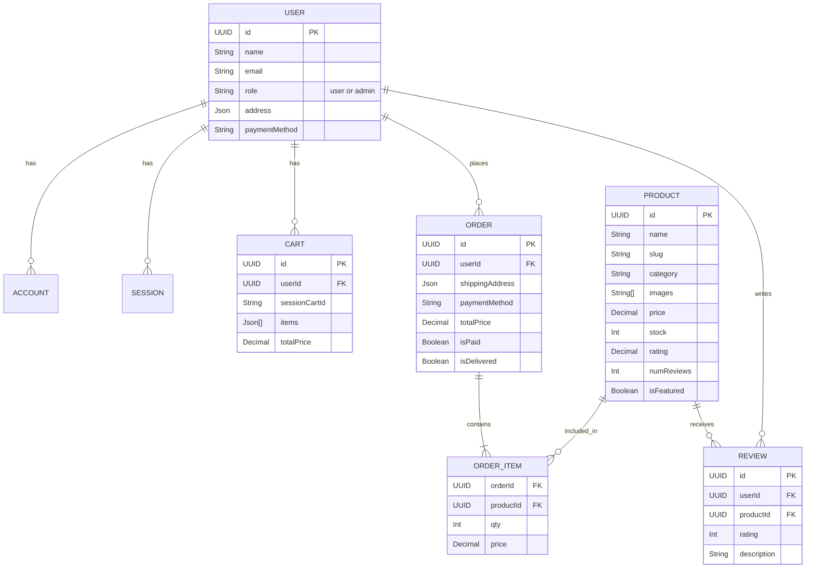

# Prostore - Project Explanation

## Project Overview
Prostore is a full-featured, modern e-commerce web application built using **Next.js (App Router)**, **TypeScript**, and **PostgreSQL**. It provides a complete shopping experience, from browsing products and managing a cart, to secure checkout and order tracking. It also includes an admin dashboard for managing products, users, and business analytics.

## Technology Stack
- **Frontend & Framework**: [Next.js 15](https://nextjs.org/) (React 19)
- **Styling**: [Tailwind CSS v4](https://tailwindcss.com/) with Shadcn UI (Radix UI primitives)
- **Database & ORM**: PostgreSQL (via [Neon](https://neon.tech/)) and [Prisma ORM](https://www.prisma.io/)
- **Authentication**: [NextAuth.js (v5 Beta)](https://next-auth.js.org/)
- **Payments**: Stripe API and PayPal integration
- **File Uploads**: Uploadthing (for product images)
- **Emails**: Resend & React Email
- **State Management**: React Hooks and Next.js Server Actions

## Application Flow
1. **Authentication**: Users can sign up and log in using NextAuth. It supports secure credential management and role-based access control (Admin vs. User).
2. **Product Browsing**: 
   - Products are fetched dynamically from the PostgreSQL database using Prisma.
   - Users can search, sort, and filter products with built-in pagination.
   - The homepage highlights "Featured" products via promotional banners.
3. **Cart Management**:
   - Uses a database-backed session cart. If a user is not logged in, a session ID keeps track of their cart.
   - When a user logs in, the session cart automatically merges/attaches to their user account.
4. **Checkout Process**:
   - **Shipping Address**: User enters their shipping details.
   - **Payment Method**: User selects between Stripe (Credit Card), PayPal, or Cash on Delivery.
   - **Place Order**: The application securely creates an `Order` and associated `OrderItem` records in the database, and clears the cart.
   - **Payment Processing**: Seamless integration with Stripe/PayPal webhooks to capture funds and automatically mark the order as `isPaid`.
5. **User Dashboard**: Users can track their order history, view payment receipts, and manage their profile details.
6. **Admin Dashboard**: Admins have access to an analytics dashboard (featuring charts built with Recharts) and can perform CRUD operations on products, manage all user orders, and handle user permissions.

## Data Model Diagram (Entity-Relationship)

The database schema revolves around several core entities linked together relationally:

### Key Models Explanation:
- **User**: Stores user details, roles (admin/user), encrypted passwords, and default addresses.
- **Product**: Holds all product metadata including price, stock availability, aggregate ratings, and image URLs hosted on Uploadthing.
- **Cart**: Represents a shopping cart. Tied to either a logged-in `userId` or an anonymous `sessionCartId` to persist carts across sessions.
- **Order & OrderItem**: `Order` holds the high-level checkout information (total price, shipping address, payment status), while `OrderItem` holds the specific products and quantities bought.
- **Review**: Allows users to leave a rating and descriptive review for a specific product, complete with verified purchase checks.

## Key Architectural Decisions
- **Next.js Server Actions**: Form submissions and database mutations are handled entirely via secure Server Actions, eliminating the need for standalone API routes and reducing client-side JavaScript.
- **Edge Compatibility**: Utilizes the Prisma adapter for Neon (`@prisma/adapter-neon`) alongside `@neondatabase/serverless` to ensure database queries can be executed blazingly fast from Edge environments.
- **Component Library**: Leverages accessible Radix UI primitives wrapped in Tailwind CSS for a highly customizable and modern UI/UX (Shadcn pattern).
